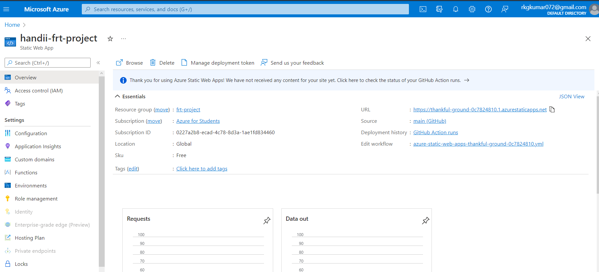

<h1 align="center">Handii : Online Fashion & Lifestyle Store for Handbags</h1>

## Problem Statement :
A fashion store website that assists customers in locating low-cost, high-quality items (particularly handbags) to meet their specific demands.

## Project Description:
I designed a fashion store website named "Handii" . It aids the buyer in locating a suitable product on the website(specially handbags). I made the website entirely responsive and included more pages such as a blog, store, and contact-us etc. for various purposes.
>I'm attempting to tackle a real-world problem, such as finding a decent and authentic product these days. 

As a result, I created a web application in which I attempted to provide all product information. My project assists customers in receiving things at their doorstep as well as providing genuine stuff.

## Project Demo URL: 
https://thankful-ground-0c7824810.1.azurestaticapps.net

<h1 align="center"> Tools Used :</h1>

  

<h1 align="center"> Website UI </h1>
<h3> Homepage </h3>

<h3> Store & Blog</h3> 
  
 

 

 Azure Static Web Apps Project View :

 

 Full Website View :

 

