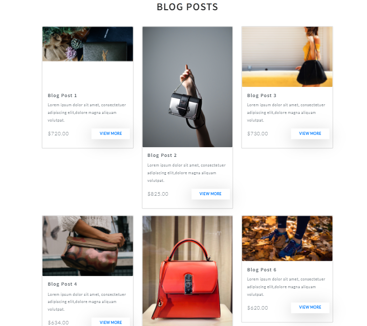

# Final FRT Project

##
A fashion store website that assists customers in locating low-cost, high-quality items (particularly handbags) to meet their specific demands.

## Project Description:
I designed a fashion store website named "Handii" . It aids the buyer in locating a suitable product on the website(specially handbags). I made the website entirely responsive and included more pages such as a blog, store, and contact-us etc. for various purposes.
>I'm attempting to tackle a real-world problem, such as finding a decent and authentic product these days. 

As a result, I created a web application in which I attempted to provide all product information. My project assists customers in receiving things at their doorstep as well as providing genuine stuff.

 

 
 

